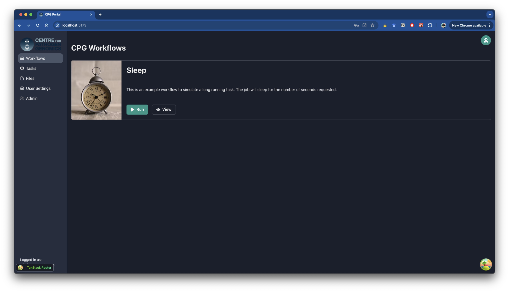
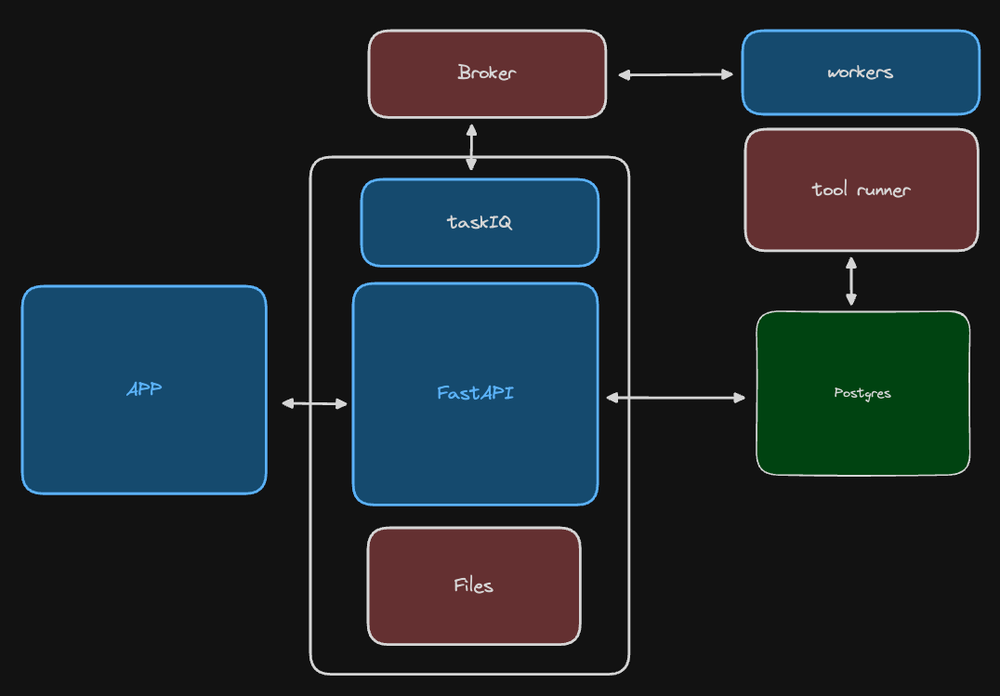

# CPG Portal

This mono-repo contains the source code for the CPG Portal. 

The CPG Portal is design to be completely* data driven. Tasks are configure/managed/run via the API and stored in the database. The front-end components (e.g. forms and results) are dynamically generated based on the Task data.

There is a central API that manages the tasks and a front-end that allows users to interact with the tasks. The front-end is a React application. The API is a FastAPI application that uses SQLModel to interact with the database. Task running is managed by Taskiq (Distributed task queue with full async support).

## Development

Read the [development.md](development.md) file for more information on how to set up your development environment.

## Deployment

Read the [deployment.md](deployment.md) file for more information on how to deploy the CPG Portal.

## License

This project is licensed under the MIT License - see the [LICENSE](LICENSE) file for details. This project was developed by Wytamma Wirth and base on the [full-stack-fastapi-template](https://github.com/fastapi/full-stack-fastapi-template) by Sebastián Ramírez.